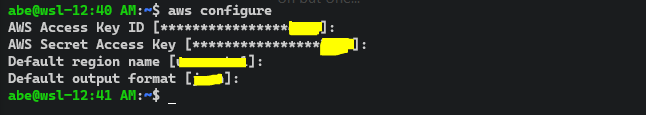
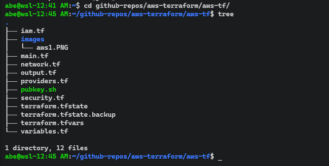
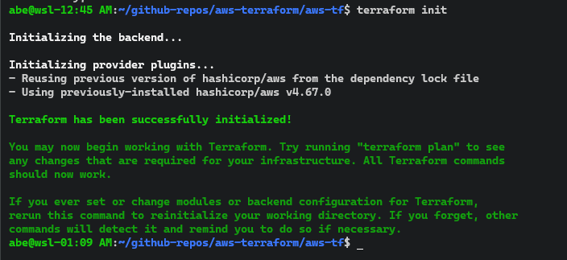
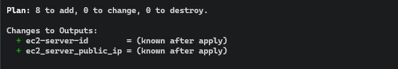
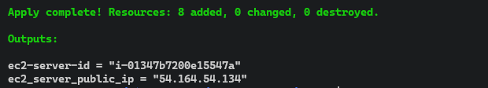
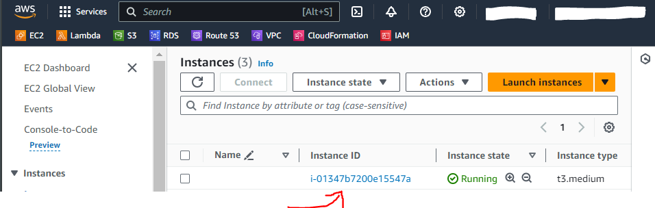
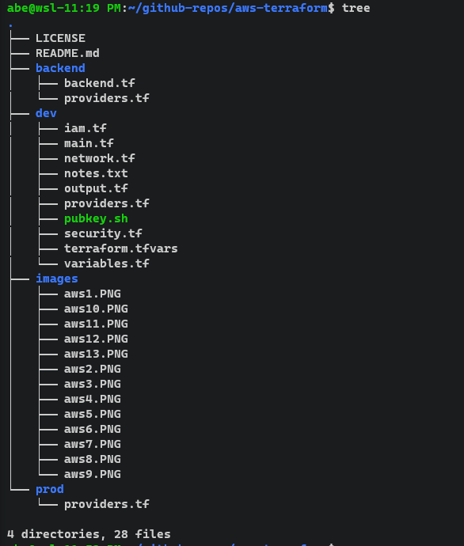

## aws-terraform
The objective of this repo is to set up the environment in order to deploy AWS resources using Terraform.
### Architecture
This architecture is to outline what ia being created. 
It is a simple architecture that is not intended to be used in any real work scenario. 
This is just to practice provisioning AWS resources using IaC (Terraform).  

### Configure the Environment and Deploy

#### Pre-requisites

* Have an [AWS account](https://aws.amazon.com/resources/create-account/)

* Install [Terraform](https://developer.hashicorp.com/terraform/tutorials/azure-get-started/install-cli) and [AWS CLI]() 
**Note**: We will be using [Windows WSL](https://code.visualstudio.com/docs/remote/wsl-tutorial) CLI in VS Code 
#### 1. Authenticate to the AWS Account - Using the CLI

* Create AWS [access keys](https://docs.aws.amazon.com/cli/latest/userguide/cli-services-iam-create-creds.html) for the IAM user

* Install the [AWS CLI](https://docs.aws.amazon.com/cli/latest/userguide/getting-started-install.html) on your host 

* On your terminal, run `aws configure` - it should look like this: 

* Then, create the folder structure and write your Terraform codes to create the EC2
* This is the folder structure I have for this case - some files are missing (see `.gitignore` file) 

* Create your [ssh key pairs](https://ercanermis.com/creating-ssh-keys-for-secure-access-to-aws-ec2-instances-with-terraform/) from your local machine
* Make sure to copy the public key pair to the EC2 from the Terraform code - see `security.tf` file
* Once files are ready, run `terraform init` to initialize the environment 

* Run `terraform plan` - it should show you what will be created 

* Finally, run `terraform apply --auto-approve` to create the resources 

* You can see on the portal that the instance with the ID `i-01347b7200e15547a` was created 

* Now [ssh](https://cloudinfrastructureservices.co.uk/how-to-create-linux-aws-ec2-instance-using-terraform/) to the EC2 created - make sure to specify the pathe to the private key 
    * Run the command `sudo ssh -i "/path/to/private/key/pair/you/created/<key_name>" <username>@<public_ip>`
    
    * We can also access the NGINX server we (EC2) - just put the public IP address to the browser.
    

* Clean up to avoid charges - run `terraform destroy --auto-approve` 

* See [Terraform CLI](https://developer.hashicorp.com/terraform/cli/commands) for more Terraform commands.  
#### 2. Use GitHub Action - A pipeline
* Using Github Actions here to automate the above deployment.
* New folder structure  

* New inprovements:
    * Manage terraform state files using [AWS S3 bucket](https://spacelift.io/blog/terraform-s3-backend)
    * Generate [AWS Policy](https://awspolicygen.s3.amazonaws.com/policygen.html)
    * Add secrets in [Github Actions](https://docs.github.com/en/actions/security-guides/using-secrets-in-github-actions)
    * Add [manual validation](https://dineshba.github.io/posts/github-actions-approval/) before deploying/destroying
* Deploying after configuration: 
    * Choose the environment to be deployed 
    
    * Deploy the environment using the create pipeline 
    
    * Destroy the environment using the destroy pipeline 
    
* Possible improvements: 
    * Add test stage
    * Add security scanning stage
    * More ...
#### Sources
1. [Find an Ubuntu AMI here](https://cloud-images.ubuntu.com/locator/ec2/)
6. [Open/Close port in Windows](https://www.liquidweb.com/kb/open-a-port-in-windows-firewall/)
